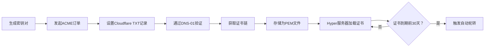

以下是为您设计的Rust库**acme_commander**（项目名取自经典RTS游戏《Command & Conquer》的“指挥官”角色，寓意自动化证书调度），专注于自动化TLS证书管理，符合RFC8555标准和Rust命名规范（`kebab-case`）。

---

### **项目结构（目录树）**
```rust
acme_commander/
├── Cargo.toml                # 项目配置及依赖
├── src/
│   ├── lib.rs                # 库入口，公开接口
│   ├── ca/                   # 证书颁发机构适配
│   │   ├── mod.rs            # 统一暴露CA模块
│   │   ├── lets_encrypt.rs   # Let's Encrypt实现
│   │   ├── zero_ssl.rs       # ZeroSSL实现
│   │   └── free_ssl.rs       # freessl.cn实现
│   ├── crypto/               # 加密模块
│   │   ├── mod.rs            # 密钥生成逻辑
│   │   ├── ecdsa.rs          # ECDSA/secp384r1密钥对生成
│   │   └── pem.rs            # PEM格式编码/解码
│   ├── dns/                  # DNS验证模块
│   │   ├── mod.rs            # DNS服务抽象
│   │   └── cloudflare.rs     # Cloudflare Token操作（DNS-01）
│   ├── certificate/          # 证书生命周期管理
│   │   ├── mod.rs            # 证书结构定义
│   │   ├── cert.rs           # 证书加载/解析方法
│   │   ├── loader.rs         # 热加载逻辑
│   │   └── renewal.rs        # 轮转策略（到期前N天触发）
│   ├── acme/                 # ACME协议核心
│   │   ├── mod.rs            # ACME客户端入口
│   │   ├── client.rs         # ACME请求处理（订单/挑战）
│   │   └── model.rs          # ACME数据模型（JWS/JWK）
│   ├── integration/          # 第三方集成
│   │   ├── mod.rs            # 集成适配器
│   │   └── hyper.rs          # Hyper服务器热加载实现
│   └── error.rs              # 统一错误类型
└── examples/                 # 使用示例
    └── hyper_server.rs       # Hyper集成演示
```

---

### **关键组件说明**
1. **证书生成流程**  
   - **密钥生成** (`crypto/ecdsa.rs`)：  
     使用`ring::signature::EcdsaKeyPair`生成secp384r1密钥对，输出为PEM格式。
   - **ACME订单** (`acme/client.rs`)：  
     伪代码示例：
     ```rust
     async fn request_cert(domain: &str, cloudflare_token: &str) -> Result<Certificate> {
         let key_pair = generate_secp384r1_key(); // 生成密钥
         let order = AcmeOrder::new(domain);
         let challenge = order.init_dns01_challenge(); // 仅DNS-01
         dns::cloudflare::create_txt_record(
             challenge.dns_name, 
             challenge.token, 
             cloudflare_token
         ).await?; // 调用Cloudflare API
         order.finalize_after_validation().await?; // 验证后获取证书
         Certificate::from_pem(order.cert_chain, key_pair) // 组合证书链+私钥
     }
     ```

2. **自动轮转与热加载**  
   - **轮转策略** (`certificate/renewal.rs`)：  
     基于证书的`not_after`字段，在到期前动态计算续期时间（可配置1-30天）。
   - **热加载机制** (`certificate/loader.rs`)：  
     使用`AtomicReference`持有当前证书，后台线程监控更新：
     ```rust
     struct HotCertLoader {
         current: Arc<AtomicReference<Arc<rustls::Certificate>>>, // 原子引用
         path: PathBuf, // 证书文件路径
     }
     impl HotCertLoader {
         fn reload_if_needed(&self) {
             if is_renewal_triggered() { // 轮转条件检查
                 let new_cert = load_cert_from_disk(&self.path);
                 self.current.store(Arc::new(new_cert)); // 原子替换
             }
         }
     }
     ```

3. **与Hyper集成** (`integration/hyper.rs`)  
   包装`rustls::ServerConfig`实现动态证书加载：
   ```rust
   struct AutoReloadTlsAcceptor {
       config: Arc<Mutex<rustls::ServerConfig>>, // 可变的TLS配置
       loader: HotCertLoader, // 热加载器
   }
   impl AutoReloadTlsAcceptor {
       pub fn new() -> Self {
           let loader = HotCertLoader::init();
           let config = rustls::ServerConfig::builder()
               .with_certificates(loader.current_cert()) // 初始证书
               .build();
           spawn_background_reloader(loader, config.clone()); // 后台重载线程
           Self { config, loader }
       }
   }
   // 在Hyper中绑定TLS Acceptor
   let acceptor = AutoReloadTlsAcceptor::new();
   let server = hyper_server::bind(addr).serve(acceptor);
   ```

---

### **工作流示例（证书申请+轮转）**


---

### **优势与特性**
- **安全合规**：强制使用ECDSA/secp384r1，符合现代TLS最佳实践。
- **零HTTP-01依赖**：仅通过Cloudflare Token完成DNS-01验证，适合无公网IP的服务。
- **无缝热加载**：证书更新无需重启服务，通过原子替换避免连接中断。
- **多CA兼容**：统一接口支持Let's Encrypt/ZeroSSL/freessl.cn，可通过feature切换。

> **命名梗概**：  
> 《Command & Conquer》中的“ACME指挥官”（ACME Commander）象征自动化调度能力，符合Rust命名规范（`acme_commander`）。